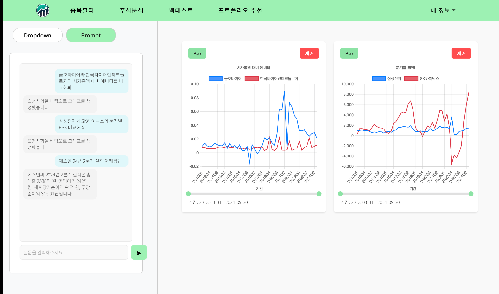
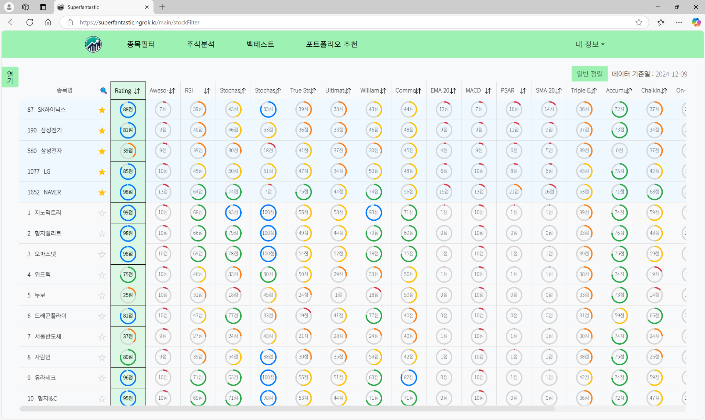
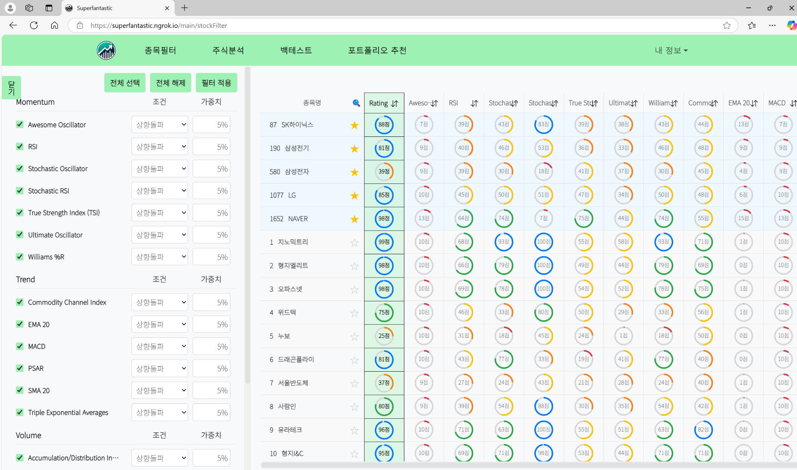
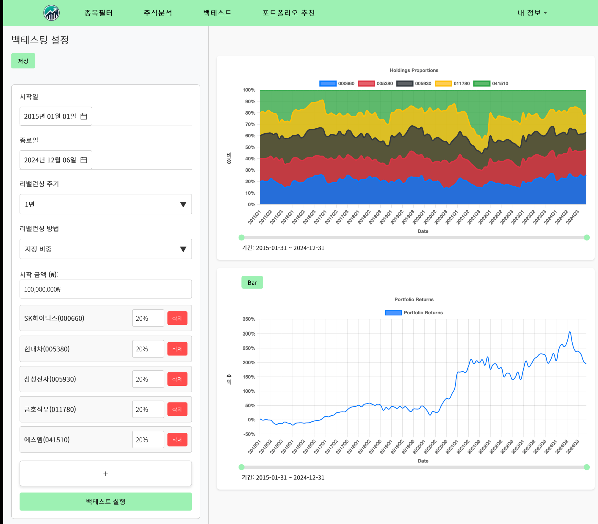
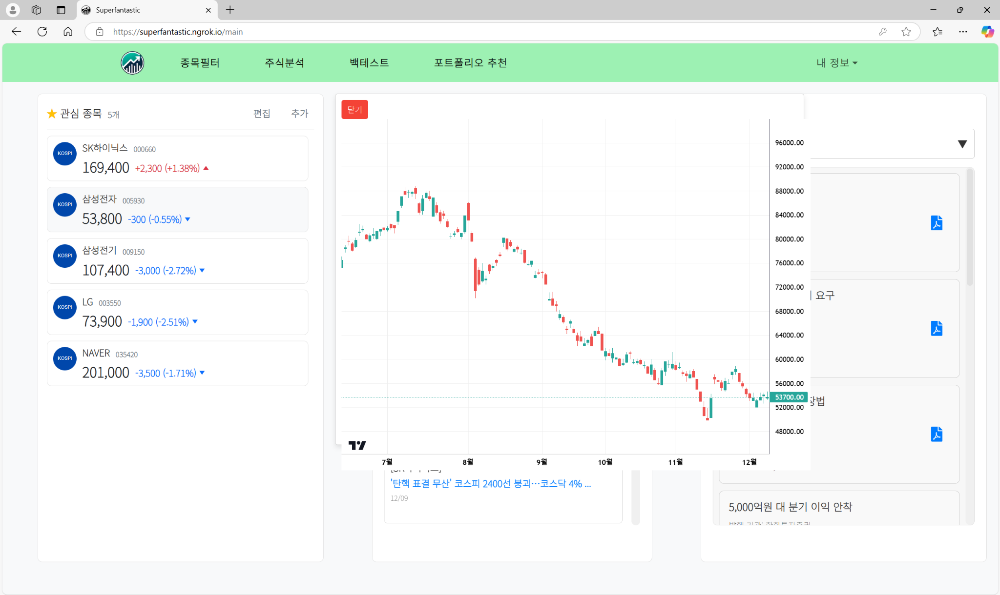
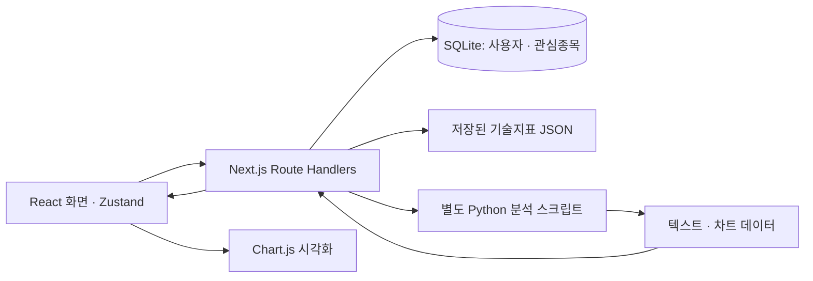

# SuperFantastic

**코스콤 연계 데이터 기반 주식투자 포트폴리오 · 산학실전캡스톤**

기술지표로 투자 후보를 찾고, 기업의 재무정보를 비교한 뒤, 포트폴리오를 백테스팅하는 과정을 하나의 웹 서비스로 연결한 팀 프로젝트입니다. 드롭다운과 자연어 질문으로 기업을 분석하고, 관심종목을 계정별로 관리할 수 있도록 구현했습니다.

| 항목 | 내용 |
| --- | --- |
| 개발 기간 | 2024.09 – 2024.12 |
| 팀 | SUPERFANTASTIC |
| 기여 | 고두범 · 프론트엔드·백엔드 구현, Python 분석 결과 연동 |
| 팀 성과 | 2024 전북대학교 SW중심대학 산학실전캡스톤 최우수상 |

## 팀 구성과 역할

| 팀원 | 담당 역할 |
| --- | --- |
| 백정렬 | 팀장 · Python 기반 RAG 시스템 개발 |
| 고두범 | 프론트엔드·백엔드 구현 · Next.js API, JWT 인증, 관심종목 저장 및 분석 결과 연동 |
| 이정우 | Figma 기반 웹 화면 기획·디자인 · 프론트엔드 일부 구현 참여 |
| 이장혁 | 프로젝트 문서 작업 |

## 주요 화면

2024년 프로젝트 시연 화면입니다.

### 자연어 기업 분석

질문에 대한 텍스트 답변과 기업 간 지표 비교 그래프를 같은 화면에서 확인합니다. 아래 화면에는 삼성전자·SK하이닉스의 분기별 EPS 비교와 실적에 대한 텍스트 답변이 함께 표시되어 있습니다.

### 기술지표 기반 종목필터

종목별 기술지표 점수와 종합 Rating을 조회하고, 검색·정렬·관심종목 표시로 투자 후보를 탐색합니다. 필터 패널에서는 지표별 상향·하향 돌파 조건과 가중치를 설정합니다.

지표 조건·가중치 설정 화면 보기

### 포트폴리오 백테스팅

기간, 리밸런싱 주기·방법, 종목과 비중을 설정하고 분석 결과를 확인합니다. Python 실행 결과의 보유 비중과 포트폴리오 수익률을 각각 차트로 연결했습니다.

백테스팅 설정·결과 화면 보기

### 관심종목과 주가 차트

관심종목 목록을 중심으로 주가 차트, 관련 뉴스, 최근 리포트를 조회하는 메인 화면을 구성했습니다.

관심종목·주가 차트 화면 보기

## 주요 기여

### 1. Python 분석 결과를 텍스트와 그래프로 연결

Python 분석 결과가 일반 문자열 또는 차트용 JSON으로 반환되어, 화면에서 응답을 일관되게 처리할 필요가 있었습니다.

- Next.js Route Handler에서 Python 프로세스의 표준 출력을 수신하고 JSON 파싱 여부에 따라 응답을 분기했습니다.
- 차트 데이터는 지표·기업·날짜·값 구조를 검사하고, 일반 문자열과 차트 형식이 아닌 JSON은 메시지로 반환했습니다.
- 프론트엔드에서 응답 유형에 따라 대화 메시지 또는 Chart.js 그래프를 표시하고, 차트 유형 전환·기간 조절·그래프 제거를 연결했습니다.

이 기능에서는 **Python 분석 실행 연동, 응답 처리, 프론트엔드 시각화**에 기여했습니다.

관련 코드: [자연어 분석 API](src/app/api/getGraphData-prompt/route.js) · [차트 데이터 검증](src/utils/graph-reconstruction.js) · [프롬프트 UI](src/components/financial-data/prompt/financial-prompt.js) · [차트 UI](src/components/graphs/financial-graph.js)

### 2. 약 2,400개 종목 테이블의 행 가상화

다수의 기술지표를 가진 약 2,400개 종목을 한 번에 DOM에 렌더링하는 부담을 줄이기 위해 `react-window`의 `FixedSizeList`를 적용했습니다. 화면에 보이는 영역과 인접 행만 렌더링하면서 검색 결과로 이동, 지표별 정렬, 관심종목 우선 표시를 지원했습니다.

현재 저장소의 기술지표 데이터는 **2024-11-18 기준 2,409개 종목**입니다. 발표 화면의 데이터 기준일과는 차이가 있습니다.

관련 코드: [회원 종목 테이블](src/components/technical-analysis/technical-table/technical-table.js) · [비회원 종목 테이블](src/components/technical-analysis/technical-table/no-login-table.js) · [가중치 반영 API](src/app/api/stockFilter/route.js) · [저장 데이터](src/app/data/data_processed.json)

### 3. 회원 인증과 계정별 관심종목 저장·동기화

관심종목을 계정별로 저장하고 다시 불러올 수 있도록 Next.js Route Handlers와 SQLite를 연결했습니다.

- 회원가입 시 bcrypt로 비밀번호를 해싱하고, 로그인 시 비밀번호를 비교해 JWT를 발급했습니다.
- JWT는 HttpOnly 쿠키에 저장하고, 토큰 검증 API로 로그인 상태를 확인했습니다.
- SQLite에 사용자별 관심종목을 저장하고, 사용자·종목 코드의 복합 UNIQUE 인덱스로 중복 저장을 제한했습니다.
- Zustand 상태와 관심종목 조회·추가·삭제 API를 연결해 화면 간 목록을 공유했습니다.

관련 코드: [회원가입](src/app/api/auth/signup/route.js) · [로그인](src/app/api/auth/login/route.js) · [토큰 검증](src/app/api/auth/verify/route.js) · [DB 스키마](db.js) · [관심종목 API](src/app/api/interestedItems/route.js) · [상태 관리](src/store/authStore.js)

## 기술 구성

| 영역 | 기술 및 용도 |
| --- | --- |
| 웹 애플리케이션 | Next.js 14 App Router, React 18, JavaScript |
| UI·상태 관리 | CSS Modules, Bootstrap / React Bootstrap, Zustand |
| 시각화 | Chart.js / react-chartjs-2, lightweight-charts |
| 대규모 목록 | react-window |
| 서버 API | Next.js Route Handlers, Node.js child_process를 통한 Python 실행 |
| 인증·저장 | SQLite / better-sqlite3, JWT / jsonwebtoken, bcrypt |

현재 저장소에서 확인되는 요청 흐름은 다음과 같습니다.

